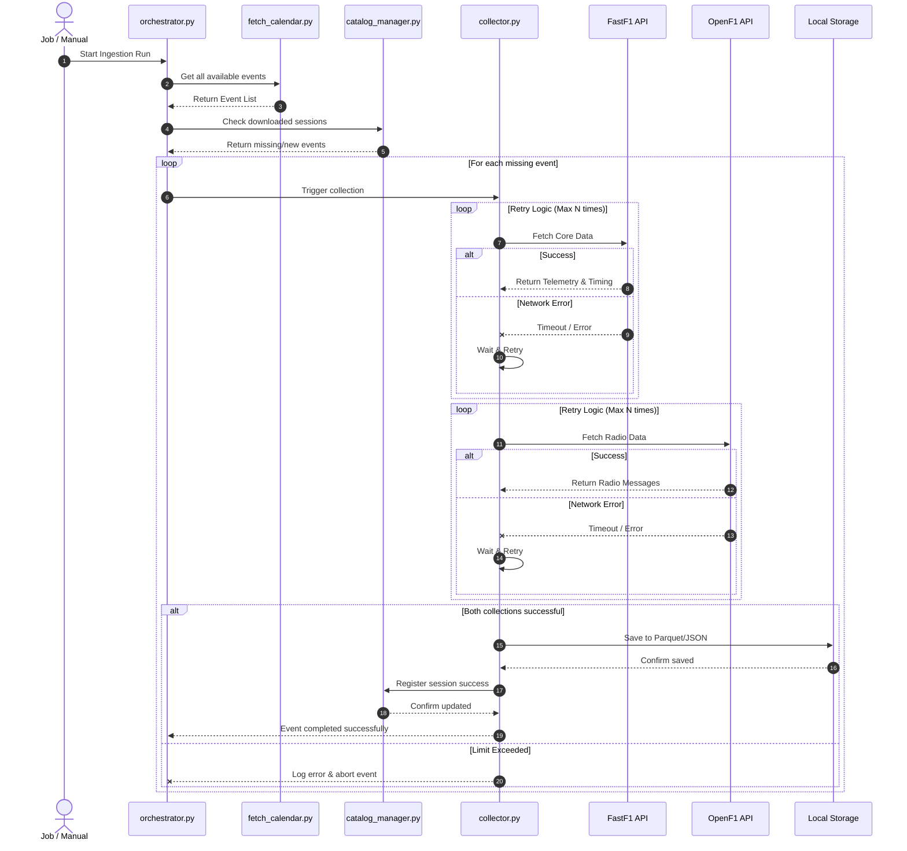

# Warehouse Ingestion System Documentation

This document outlines the architecture and execution flow of the Data Warehouse Ingestion system (Bronze Layer). The system is built using four independent, modular components that ensure robust, continuous data collection from the FastF1 and OpenF1 APIs.

## 1. System Architecture

The ingestion pipeline relies on the following core modules:

### A. `fetch_calendar.py` (Race Discovery)
*   **Role**: Dynamic schedule provider.
*   **Functionality**: Queries external F1 schedules to retrieve a comprehensive list of all historical races (seasons) and live events.
*   **Output**: Returns a standardized, iterable list of session identifiers (Year, Location, Event Name, Session Type).

### B. `collector.py` (Data Collection Engine)
*   **Role**: Isolated worker script for downloading complete datasets for a **single specific session**.
*   **Execution Flow**:
    1.  **FastF1 Extraction**: Connects to the FastF1 API to pull all core timing, telemetry, weather, and session status data.
    2.  **OpenF1 Extraction**: Connects to the OpenF1 API to pull corresponding team radio communications.
*   **Resilience & Retry Mechanism**: 
    *   All network calls are wrapped in a robust retry loop.
    *   Utilizes exponential backoff for network timeouts or API rate limits.
    *   Enforces a strict upper retry limit to prevent infinite hangs. If the limit is reached, the process gracefully fails, logging the missing session for future retry attempts.

### C. `orchestrator.py` (The Cycler)
*   **Role**: The central execution manager of the ingestion pipeline.
*   **Functionality**:
    *   Fetches the master list of sessions from `fetch_calendar.py`.
    *   Cross-references this list against the Data Catalog to identify missing or incomplete sessions.
    *   Cycles through the identified missing sessions, spinning up instances of `collector.py` to ingest the required data.

### D. `catalog_manager.py` (Data Entry Index)
*   **Role**: The source of truth for local data inventory.
*   **Functionality**:
    *   Documents every successfully downloaded session.
    *   Stores metadata such as file paths, download timestamps, and data completeness flags.
    *   Acts as a gatekeeper to prevent redundant API calls for data already present in the warehouse.

---

## 2. Execution Flow

The following diagram illustrates how these components interact during a standard ingestion run, emphasizing the sequence of API calls and the built-in retry mechanisms.



## 3. Directory Structure

The system is organized within the `warehouse` directory as follows:

```text
warehouse/
├── bronze/                 # Raw data storage
├── ingestion/
│   ├── fetch_calendar.py   # Race Discovery
│   ├── collector.py        # Data Collection Engine with Retries
│   ├── orchestrator.py     # The Cycler
│   └── catalog_manager.py  # Data Entry Index
└── config.py               # Centralized configuration (paths, retry limits)
```
